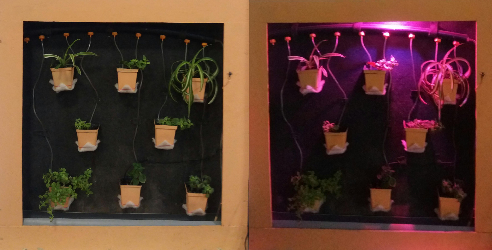
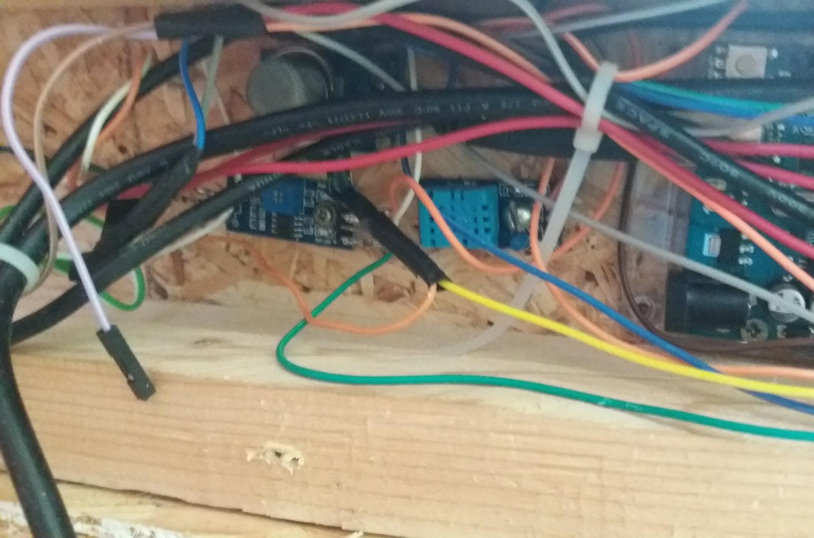
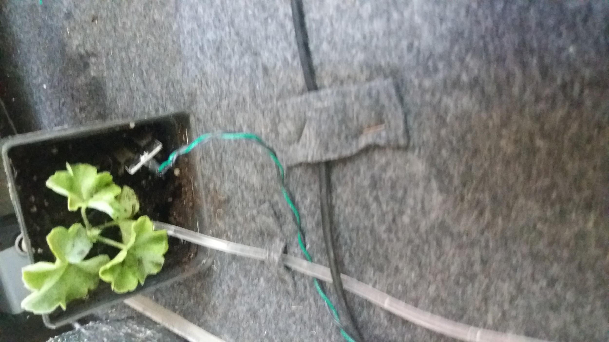
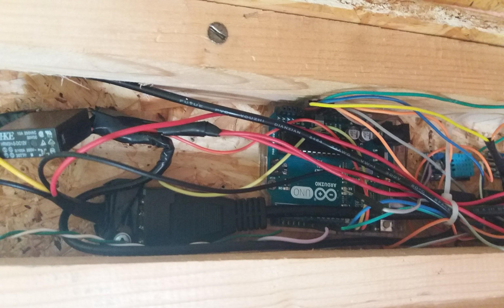
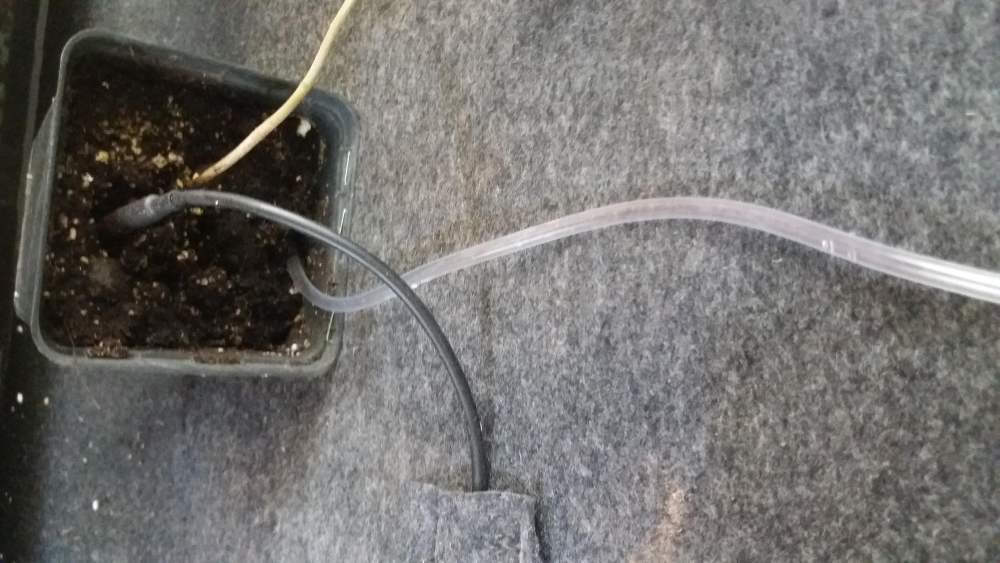
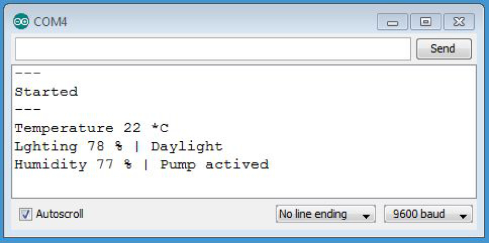
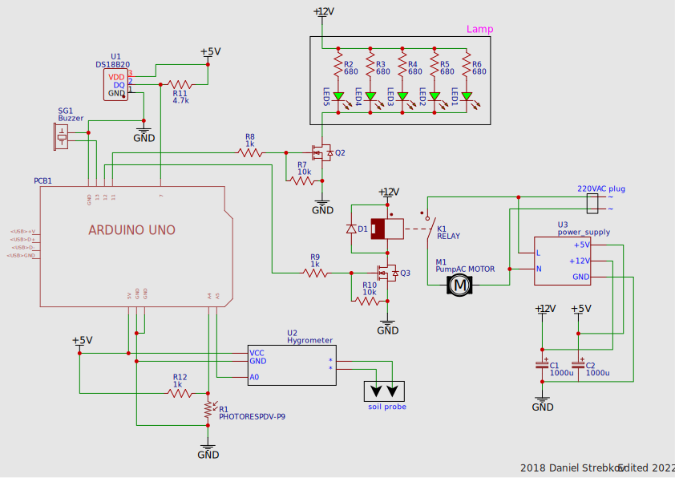

## Automated flower pot aka Lifewall

### Project functions

- Microclimate monitoring
- Self-watering and lighting
- Display via serial port

### Algorithm of program operation

- Input: Soil temperature -> display on serial port
- Input: Ambient brightness -> Turn lights ON or OFF
- Input: Soil humidity -> Turn watering pump ON or OFF

### Instruction
- Fill the irrigation tank with water
- Apply power to the circuit

The system will sound a ready-signal

A USB port and an Arduino IDE serial monitor are used to read data

Yeah, its my school project back in 2018.